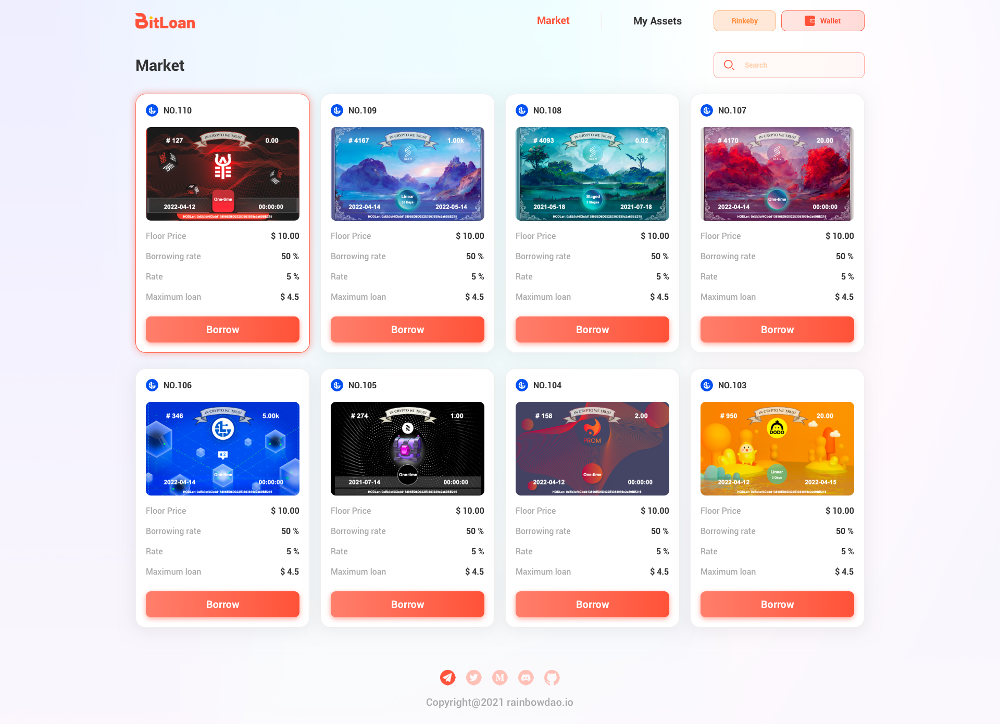

## Project name 

Bitloan


## Video link

https://youtu.be/K_lXgrcOcBk

## Submission links

GitHub repository: https://github.com/Narwhalk  

Contract link: https://github.com/Narwhalk/NFT-Mortgage-Market  

Frontend link: https://github.com/Narwhalk/bitloan-front-end  

Picture link:  https://github.com/Narwhalk/bitloan-front-end/tree/main/PIC  

## Testnet Deployment Information

### 1.Network: Rinkeby Test Network

RPC URL: https://rinkeby.infura.io/v3/  

Deployment address:  

- CREATNFT:    0x9De99D255A2B84959F94397eD2F50Ab24166dC82
- LOANMARKET:  0x765c17461712236d0ba74e259F561cDC520D8148
- BLT:         0x0E2cEA088cCD67F2b904AF4ae6aAa727e397AF8F
- BLTDEPOSIT:  0xB52A908a16006e67629b03bB3Ff087ff83853566

### 2.Network: Theta Test Network

RPC URL: https://eth-rpc-api-testnet.thetatoken.org/rpc  

Deployment address:  

- CREATNFT:   0x17ea6cd5cdee0ace8cfa5417d73d2b8ba9fb4138
- LOANMARKET: 0x49701b3132d869b6ada3e53daada3a980b0fd54b
- BLT:        0x43ab31afe4916ed7b7e9a2c122499956a9ac1d73
- BLTDEPOSIT: 0x30071c242ec222d7d7aac29d45e24de761097ca0

## What is bitloan?

Bitloan is an NFT collateralized lending marketplace where anyone can list their NFTs and stake their NFTs for P2P lending, access to short-term liquidity, and ease of funding issues.

## What is the main role of bitloan?

Users do not want to lose their NFTs, so they can mortgage their NFTs in this borrowing market to obtain short-term capital liquidity. The loan term is fixed and must be repaid within the due repayment period.

## Accomplishments that we're proud of

Pledge NFT certificates in Bitloan to obtain a certain amount of loans, so that the actual assets can be circulated and transferred in the form of NFT.

## What we learned

During the development process, we learned how to synergistically combine tokens and NFTs to achieve free exchange, obtain short-term flow of funds, and improve liquidity.


## Basic Sample Hardhat Project

This project demonstrates a basic Hardhat use case. It comes with a sample contract, a test for that contract, a sample script that deploys that contract, and an example of a task implementation, which simply lists the available accounts.

Try running some of the following tasks:

```shell
npx hardhat accounts
npx hardhat compile
npx hardhat clean
npx hardhat test
npx hardhat node
node scripts/sample-script.js
npx hardhat help
```
